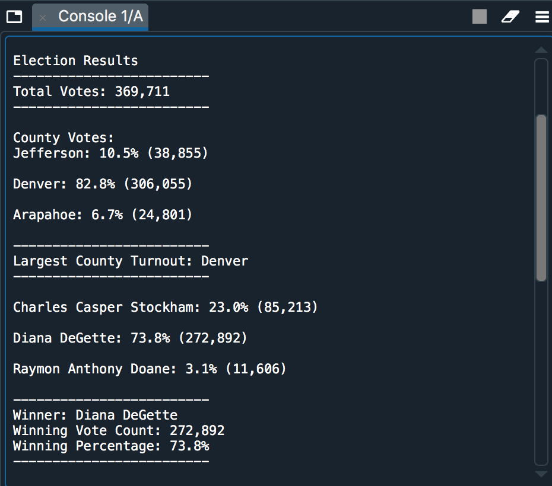

# Election Analysis with Python

## Overview of Project
A Colorado Board of Elections employee has given me the following tasks to complete the election audit of a recent local congressional election.

1. Calculate the total number of votes cast.
2. Get a complete list of candidates who received votes.
3. Calculate the total number of votes each candidate received.
4. Calculate the percentage of votes each candidate won.
5. Determine the winner of the election based on popular vote.

## Resources
- Data Source: election_results.csv
- Software: Python 3.7, Spyder 4.1.5

## Summary
The analysis of the election show that:
- There were 369,711 votes cast in the election
- The candidates were:
    - Charles Casper Stockham
    - Diana DeGette
    - Raymon Anthony Doane
- The candidate results were:
    - Charles Casper Stockham received 23.0% of the votes numbering 85,215 in total
    - Diana DeGette received 73.8% of the votes numbering 272,892 in total
    - Raymon Anthony Doane received 3.1% of the votes numbering 11,606 in total
- The winner of the election was:
    - Diana DeGette who received 73.8% of the vote and 72,892 number of votes

## Challenge Overview
The Election Commission has requested the following additional tasks to complete the audit.

1. Determine the voter turnout for each county
2. Calculate the percentage of votes from each county out of the total count.
3. Determine the county with the highest turnout

## Challenge Summary
The additional analysis shows that:
- The county vote turnout results:
    - Jefferson county received 10.5% of the votes numbering 38,855 in total
    - Denver county received 82.8% of the votes numbering 306,055 in total
    - Arapahoe county received 6.7% of the votes numbering 24,801 in total
- The county with the highest turnout was:
    - Denver county with 82.8% of the votes and 306,055 number of votes

The program can be altered to include an input function to allow candidate names, county, dates (providing a date function is included), etc to be changed for any election data to be processed. As long as the data is correctly formatted the program can analyze information for any election. A date field would need to be included in the dataset.

Example script for the input:
candidate = input("Which candidate are you looking for? ")
